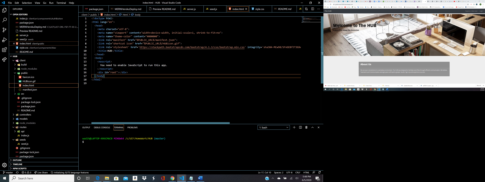

# The HUB

Project Title
This is a planner application where the team lead/manager and the users can mutally benefit from.
This application is used to organize team planning and can be used from a professional setting to just
a at home start up with friends. The application will have to two different users that will have access
to different dashboards given the position. In the dashboard the users will be able to see what the admin
has listed as announcements/goals for the day. The next page is the planner page where user will see a dynamic
calender and a planner where the user will be able to create tasks they need to do. This project is a
full stack MERN project and runs on react front end and MongoDB to save in the back end. This project also
has full authentication using passport.

Getting Started
You can get a verison of this product up and running through heroku and can see the juicy backend code through the github
page.

Prerequisites
Install
-Date-fns
-mongoose
-passport
-axios
-express
-morgan
-react
-react-dom

Deployment
Heroku

Try Me Live
<a href="https://gentle-sea-35926.herokuapp.com/">https://gentle-sea-35926.herokuapp.com/</a>
Login as admin= RWS
Password= test

Built With
React
Mongoose
Date-fns

Contributing
Please read CONTRIBUTING.md for details on our code of conduct, and the process for submitting pull requests to us.

Authors
Steven Leonardo - Front End
Wadih Ojeil- Project lead
Rogelio Martinez- Back End

License
This project is licensed under the MIT License
Full Stack Project starter with basic components routes and authentication. The project is in MVC format that includes the User model and controller. The first routes in the client are protected by the passport authentication using the local strategy. 

## Purpose and Inspiration
You can fork and run this to quickly have an MVC project up and running, then simply add the controllers models and components that your project needs. I wanted to have a place to start with no other models than the User model. This is currently at the point where you can:

## MVC
This project is structured in Full Stack Javascript with Mongoose Models REACT Views and Controllers. The heavy lifting for the authentication is done in src/utils/Auth.js.

- Register a new user
- Login with an existing user
- Log Out

## Tech Stack
+ [MONGOOSE ORM](https://www.npmjs.com/package/mongoose)
+ [EXPRESS](https://www.npmjs.com/package/express)
+ [REACT](https://reactjs.org/)
+ [NODE](https://nodejs.org/en/)
+ [PASSPORT](http://www.passportjs.org/docs/username-password/)

#### Install and run
Install all the dependencies with Yarn or NPM
`yarn install`  
Make sure you start Mongod and have mongoDB running..
`mongod`  
Then start the project
`yarn start`

## Register a New User

## Routes are protected from Users that are not logged in

